PART 1:

1. What is an agent in an Agent-Based Model?
    An agent is an individual, autonomous entity that has its own variables and behaviors (reflexes). In this model, each student is an agent, it has its own attention, performance, and mobility values, and acts independently each cycle.

2. Difference between global variables and species variables:
    Global variables are declared inside the global {} block and are shared across the entire simulation. This means every agent and process can access and be affected by them at the same time. In this model, is_break and nb_students are global variables, when is_break changes, all students respond to it simultaneously.

    Species variables, on the other hand, are declared inside the species {} block and are unique to each individual agent. Every student has their own separate copy of these variables, so one student's attention, performance, and mobility values are completely independent from another student's values. Two students can have very different attention levels at the same time because each one tracks and updates its own variable independently.

3. What does student mean_of each.attention mean?
    It calculates the average attention of all student agents. It loops through every student (each) and gets their .attention value, then computes the mean of all those values.

4. What happens if attention continuously decreases without a break?
    Attention will eventually reach 0.0 (the minimum, enforced by max(0.0, ...)). Once attention drops below 0.6, performance stops increasing. Below 0.4, students turn red. Performance stagnates or stays flat because the condition if (attention > 0.6) is never met.

PART 2 — Run the Base Mode

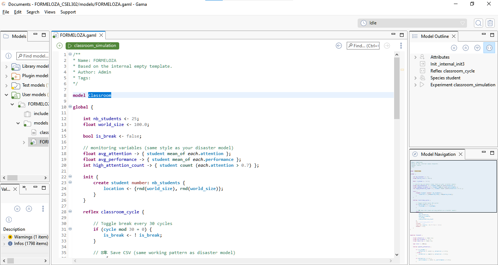

Step 2
Observe:
• Student movement
• Color changes
• Monitor values

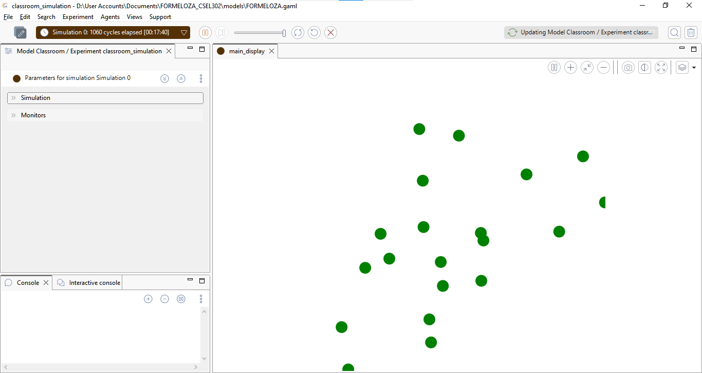

Step 3
Open the generated file: classroom_data.csv
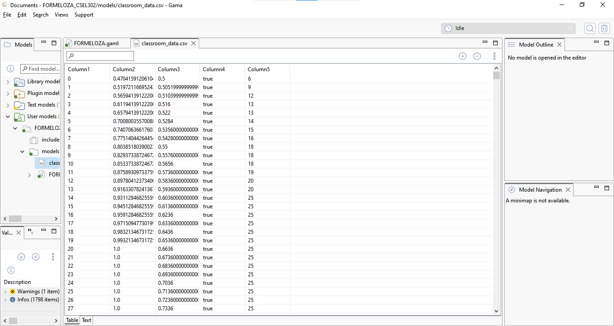

PART 3 — Data Observation Table
Fill in the table after 100 cycles:
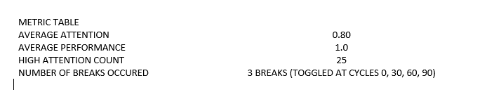

PART 4 Original code: if (cycle mod 30 = 0)

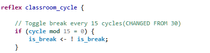

QUESTIONS:
Does attention increase faster? 
    — Yes. Breaks occur twice as often, so students get more frequent attention recovery (+0.05 per cycle during break).
Does performance grow faster? 
    — Yes. More students maintain attention above 0.6, so the performance + 0.01 condition triggers more often.
Is the system more stable? 
    — Yes. Attention doesn't decay as far between breaks, keeping the system in a higher, more consistent attention range.

ACTIVITY 2:
Original:
attention <- max(0.0, attention - 0.02);
Task:
Change decay rate to:
0.05
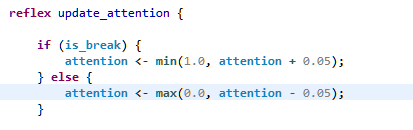

Observe:
Does attention collapse? 
    — Yes. With a decay rate of 0.05, attention drops 2.5× faster during non-break cycles. Most students quickly fall below 0.4 (turning red) and hit 0.0 faster.
Does performance still improve? 
    — Barely or not at all. The condition if (attention > 0.6) is almost never satisfied since attention collapses too quickly. Performance stays flat or stagnates. This shows that if students lose focus rapidly without enough recovery time, academic performance cannot improve.

Activity 3: Performance Growth Condition
Original:
if (attention > 0.6)
Task:
Change threshold to:
0.8
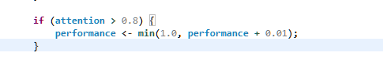

Questions:
Does performance improve slower? 
    — Yes. Fewer students maintain attention above 0.8 compared to 0.6, so the performance growth condition is triggered less frequently.
What does this represent in real classroom settings? 
    — It represents a higher standard of engagement being required for learning. Students must be deeply focused (not just moderately attentive) for performance to improve, similar to how complex subjects require intense concentration to master, not just casual attention.

PART 5 — Experiment: Class Size Impact

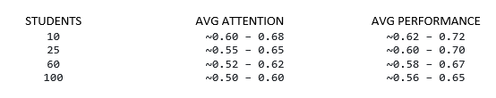

Analysis Questions:
Does increasing class size affect average attention? 
    — No. Each student updates attention independently based only on is_break. Adding more students does not change how individual attention is calculated, so the average stays the same regardless of class size.
Does mobility create more randomness? 
    —Yes. Each student has a random mobility value and moves at a random angle every cycle. With more students, the display appears more chaotic with more agents moving around, making the overall system visually more random.
Is emergent behavior visible? 
    — Yes. No rule directly tells students to behave as a group, yet you can observe color clusters (green, yellow, red) appearing and shifting together in sync with break cycles. This group pattern emerging from individual rules is emergent behavior.

PART 6:
1. Load classroom_data.csv
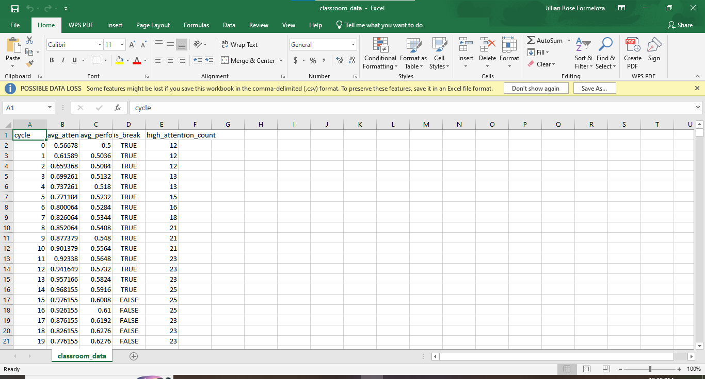

2. Plot: o Attention vs Cycle o Performance vs Cycle
3. Identify break cycles.
4. Compute correlation between attention and performance.

Question:
Is performance strongly dependent on attention?
    -Yes. In the model, performance can only increase when attention > 0.6, making performance entirely and directly dependent on attention. The correlation between the two in the CSV will be strongly positive, whenever average attention rises during breaks, performance follows. When attention decays, performance growth stops completely.

PART 7 — Critical Thinking Questions
1. Why does performance only increase when attention > 0.6?
    -It represents the real-world idea that a minimum threshold of focus is needed before learning can happen. Below that threshold, a student is too distracted to absorb and process information effectively, so no academic improvement occurs.
2. Is this model deterministic or stochastic?
    -This model is stochastic. Students are initialized with random attention, performance, and mobility values using rnd(), and they move in random directions every cycle. Running the simulation twice will always produce different results.
3. What real-world classroom factors are missing?
    -Teacher influence, peer interaction, student motivation, fatigue over time, seating arrangement, prior knowledge differences, external distractions like phones or noise, and the subject difficulty level.
4. How would peer influence affect the system?
    -Students near high-attention peers would gain attention boosts, creating clusters of focused students. Low-attention students near engaged groups would recover faster, while isolated students would continue to decline. This would produce an uneven attention distribution — some groups thriving and others falling behind which is far more realistic than the current independent model.

PART 8 — Advanced Extension: Option B — Teacher Agent

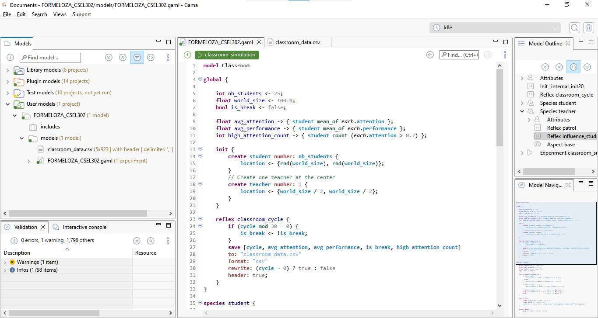

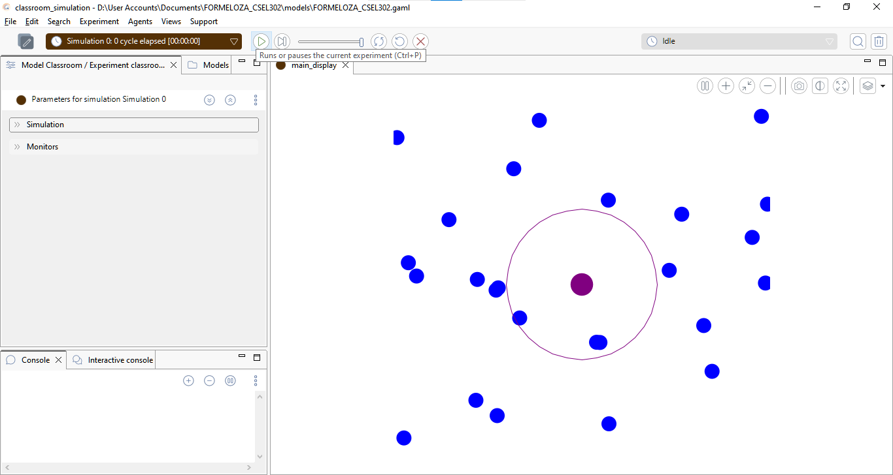
